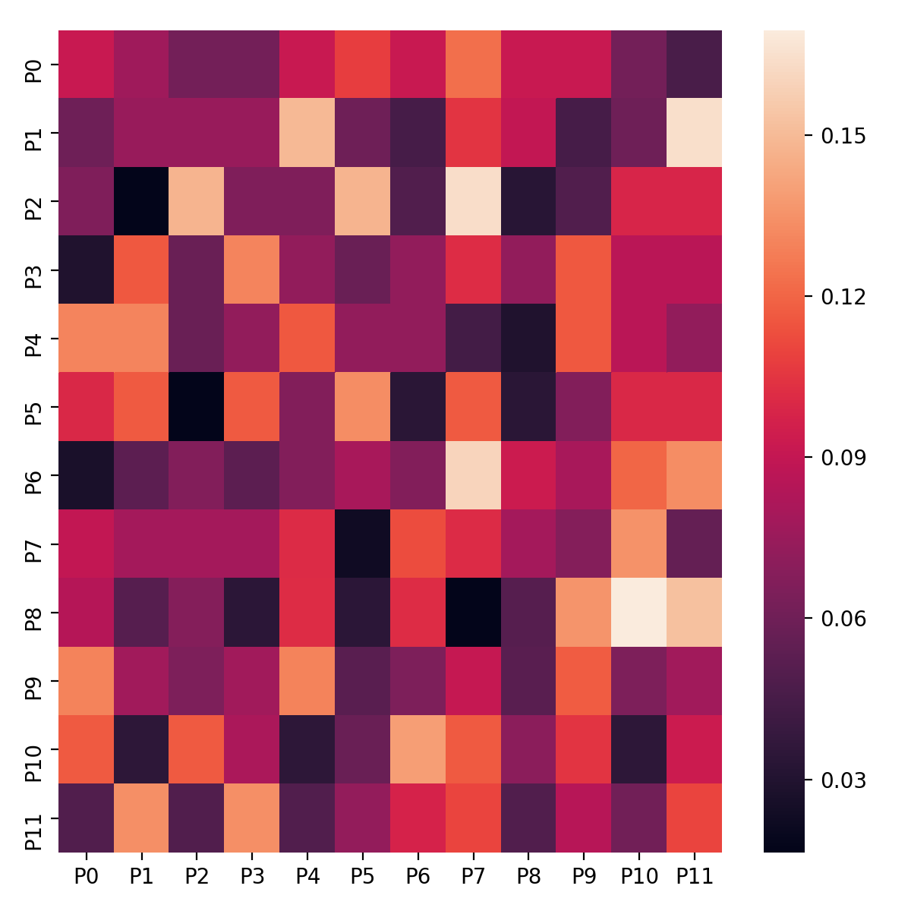

# markovclick

[](https://travis-ci.com/ismailuddin/markovclick)


Python implementation of the R package [clickstream](https://cran.r-project.org/web/packages/clickstream/index.html) which models website clickstreams as Markov chains.

---

`markovclick` allows you to model clickstream data from websites as Markov chains, which can then be used to predict the next likely click on a website for a user, given their history and current state. 

## Requirements
* Python 3.X
* numpy
* matplotlib
* seaborn (Recommended)
* pandas

## Installation
```
python setup.py install
```

## Documentation
To build the documentation, run `build html` inside the `docs/` directory. The documentation can then be launched using a web server running within the `docs/_build/html` directory. Using Python 3, this can be launched with the command `python3 -m http.server` (`python -m SimpleHTTPServer` for Python 2.7).


## Usage

### Quick start
To start using the package without any data, `markovclick` can produce dummy data for you to experiment with:

```python
from markovclick import dummy
clickstream = dummy.gen_random_clickstream(nOfStreams=100, nOfPages=12)
```


### Terminology
In the context of this package, streams refer to a series of clicks belonging to a given user. The time difference between clicks is defined by the user when assembling these streams, but is typically taken to be 30 minutes in the industry.

The pages refer to the individual clicks of the user, and thus the pages they visit. Rather than storing the entire URL of the page the user visits, it is better to encode pages using a simple code such as `PXX` where `X` can be any number. This strategy can be used to group similar pages under the same code, as modelling them as separate pages is sometimes not useful leading to an excessively large probability matrix.


#### Building Markov chains
To build a Markov chain from the dummy data:

```python
from markovclick.models import MarkovClickstream
m = MarkovClickstream(clickstream)
```

The instance `m` of the `MarkovClickstream` class provides access the class's attributes such as the probability matrix (`m.prob_matrix`) used to model the Markov chain, and the list of unique pages (`m.pages`) featuring in the clickstream.


#### Visualising as a heatmap

The probability matrix can be visualised as a heatmap as follows:

```python
sns.heatmap(m.prob_matrix, xticklabels=m.pages, yticklabels=m.pages)
```



