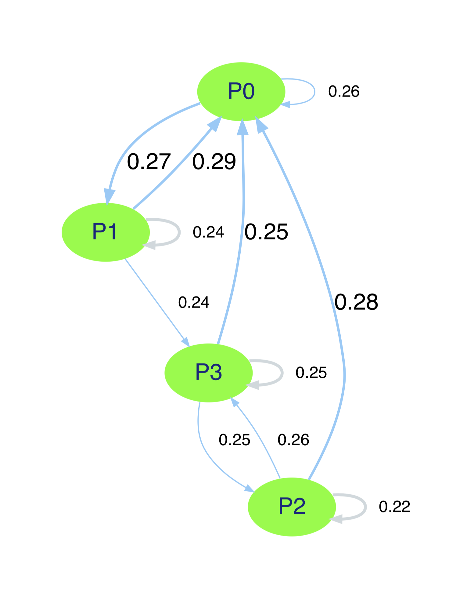

Usage
==============

Terminology
------------

In the context of this package, streams refer to a series of
clicks belonging to a given user. The time difference between clicks is defined
by the user when assembling these streams, but is typically taken to be 30
minutes in the industry.

The pages refer to the individual clicks of the user, and thus the pages they
visit. Rather than storing the entire URL of the page the user visits, it is
better to encode pages using a simple code such as `PXX` where `X` can be any
number. This strategy can be used to group similar pages under the same code,
as modelling them as separate pages is sometimes not useful leading to an
excessively large probability matrix.

Build a dummy Markov chain
---------------------------
To start using the package without any data, ``markovclick`` can
produce dummy data for you to experiment with:

.. code-block:: python

    from markovclick import dummy
    clickstream = dummy.gen_random_clickstream(nOfStreams=100, nOfPages=12)

To build a Markov chain from the dummy data:

.. code-block:: python

    from markovclick.models import MarkovClickstream
    m = MarkovClickstream(clickstream)

The instance ``m`` of the ``MarkovClickstream`` class provides access the
class's attributes such as the probability matrix (``m.prob_matrix``) used to
model the Markov chain, and the list of unique pages (``m.pages``) featuring
in the clickstream.

Visualisation
--------------

Visualising as a heatmap
//////////////////////////

The probability matrix can be visualised as a heatmap as follows:

.. code-block:: python

    sns.heatmap(m.prob_matrix, xticklabels=m.pages, yticklabels=m.pages)

.. figure:: _static/img/heatmap_example.png
   :width: 450px

Visualising the Markov chain
//////////////////////////////

A Markov chain can be thought of as a graph of nodes and edges, with the edges
representing the transitions from each state. ``markovclick`` provides a
wrapper function around the ``graphviz`` package to visualise the Markov chain
in this manner.

.. code-block:: python

    from markovclick.viz imoport visualise_markov_chain
    graph = visualise_markov_chain(m)

The function ``visualise_markov_chain()`` returns a ``Digraph`` object, which
can be viewed directly inside a Jupyter notebook by simply calling the
reference to the object returned. It can also be outputted to a PDF file by
calling the ``render()`` function on the object.

.. autofunction:: markovclick.viz.visualise_markov_chain

In the graph produced, the nodes representing the individual pages are shown
in green, and up to 3 edges from each node are rendered. The first edge is in
a thick blue arrow, depicting the most likely transition from this page /
state to the next page / state. The second edge depicted by a thinner blue
arrow, depicts the second most likely transition from this state. Finally, a
third edge is shown that depicts the transition from this page / state back to
itself (light grey). This edge is only shown if the the two most likely
transitions are not already to itself. For all transitions, the probability is
shown next to the edge (arrow).

Clickstream processing with ``markovclick.preprocessing``
----------------------------------------------------------

``markovclick`` provides functions to process clickstream data such as server
logs, which contain unique identifiers such as cookie IDs associated with each
click. This allows clicks to be aggregated into groups, whereby clicks from
the same browser (identified by the unique identifier) are grouped such that
the difference between individual clicks does not exceed the maximum session
timeout (typically taken to be 30 minutes).

Sessionise clickstream data
////////////////////////////

To sessionise clickstream data, the following code can be used that require a
`pandas` DataFrame object.

.. code-block:: python

    from markovclic.preprocessing import Sessionise
    sessioniser = Sessionise(df, unique_id_col='cookie_id',
                datetime_col='timestamp', session_timeout=30)

.. autoclass:: markovclick.preprocessing.Sessionise
    :members: __init__

With a ``Sessionise`` object instantiated, the ``assign_sessions()`` function
can then be called. This function supports multi-processing, enabling you the
split job into multiple processes to take advantage of a multi-core CPU.

.. code-block:: python

    sessioniser.assign_sessions(n_jobs=2)

.. autofunction:: markovclick.preprocessing.Sessionise.assign_sessions

The ``assign_sessions()`` function returns the DataFrame, with an additional
column added storing the unique identifier for the session. Rows of the
DataFrame can then be grouped using this column.
